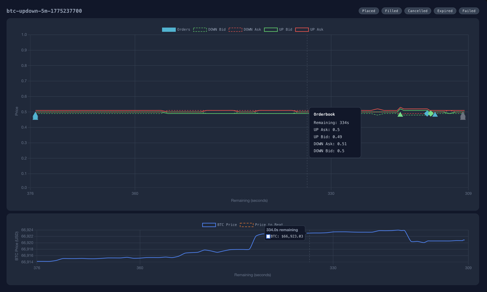
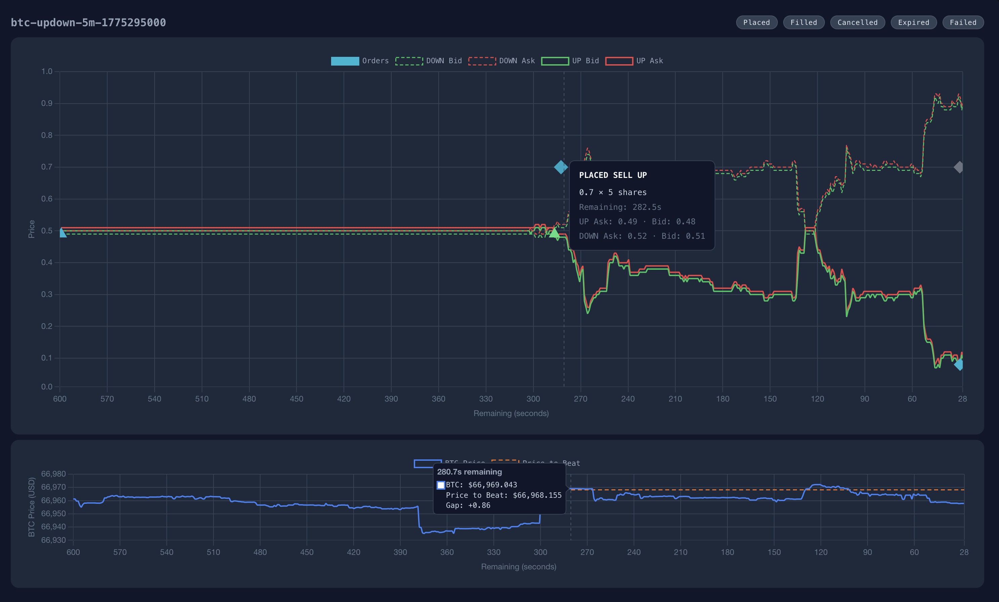
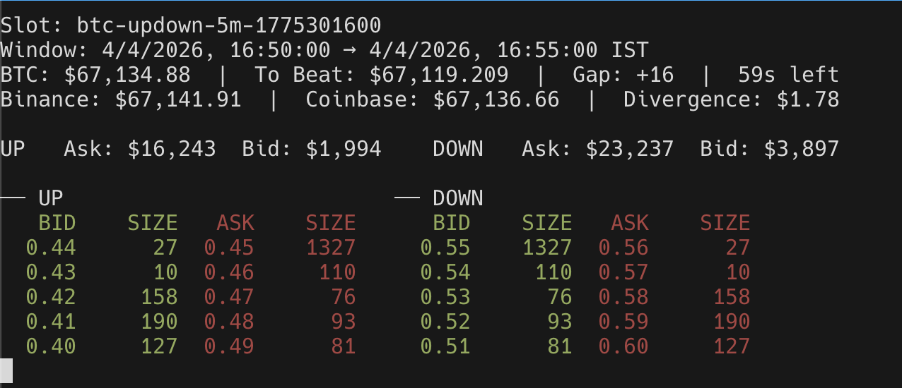

# Polymarket Trade Engine -- Strategy Development Guide

This document is the primary reference for developing strategies on the Polymarket binary prediction market trading engine. It covers the CLI interface, configuration, engine architecture, the strategy API, and best practices.

---

## Table of Contents

1. [Overview](#overview)
2. [Quick Start](#quick-start)
3. [CLI Reference](#cli-reference)
4. [Configuration](#configuration)
5. [Engine Architecture](#engine-architecture)
6. [Market Structure](#market-structure)
7. [Strategy Interface](#strategy-interface)
8. [StrategyContext API](#strategycontext-api)
9. [Order Lifecycle](#order-lifecycle)
10. [Utility Functions](#utility-functions)
11. [PnL Computation](#pnl-computation)
12. [State Persistence and Recovery](#state-persistence-and-recovery)
13. [Best Practices](#best-practices)
14. [Production Setup](#production-setup)
15. [Debugging and Visualization](#debugging-and-visualization)

---

## Overview

The engine trades binary prediction markets on Polymarket. Each market asks whether a crypto asset (BTC, ETH, XRP, SOL, or DOGE) will finish above or below a reference price (the "price to beat") at the end of a 5-minute or 15-minute window. The engine manages market discovery, order book subscriptions, order placement, fill tracking, and PnL accounting. Your job as a strategy author is to implement a single async function that decides what to buy, when to sell, and how to react to fills and expirations.

---

## Quick Start

```bash
# Simulation mode -- 10 rounds with default strategy
# See "Best Practices" section for why simulation matters
bun run index.ts --rounds 10

# Simulation mode -- specific strategy, enter 2 slots ahead
bun run index.ts --strategy simulation --slot-offset 2 --rounds 10

# Production mode -- see the "Production Setup" section below
# PRIVATE_KEY=0x... bun run index.ts --strategy simulation --prod
```

### Included Strategies

The repository ships with two strategies, both designed for simulation only. They are heavily commented and serve as the best starting point for understanding how the engine API works. Read through the source code carefully before writing your own.

| Strategy | `--strategy` flag | File | Description |
|----------|-------------------|------|-------------|
| Simulation | `simulation` | `engine/strategy/simulation.ts` | Minimal example. Places a buy at 0.49 immediately, sells at 0.70 on fill, and emergency sells if the sell hasn't filled 30 seconds before market close. Demonstrates `postOrders`, callback chaining, `expireAtMs`, `emergencySells`, and the cleanup return pattern for clearing timers on destroy. |
| Late Entry | `late-entry` | `engine/strategy/late-entry.ts` | Event-driven strategy that waits for indicator conditions (ATR, gap safety, divergence, peak gap ratio) before entering late in the market window. Demonstrates `ctx.hold()`, `setInterval`-based market ticking, indicator computation, stop-loss logic, and emergency exits. |

```bash
# Run the simulation strategy for 10 rounds
bun run index.ts --strategy simulation --rounds 10

# Run the late-entry strategy for 5 rounds
bun run index.ts --strategy late-entry --rounds 5
```

---

## CLI Reference

```
bun run index.ts [options]
```

| Flag | Type | Default | Description |
|------|------|---------|-------------|
| `-s, --strategy <name>` | string | First registered strategy | Strategy to run. |
| `--slot-offset <n>` | positive integer | `1` | Which future market slot to pre-enter. `1` means the next upcoming slot, `2` means the slot after that. |
| `--prod` | boolean flag | `false` | Run against the real Polymarket CLOB. Requires `PRIVATE_KEY`. Prompts for confirmation unless `FORCE_PROD=true`. |
| `--rounds <n>` | integer | unlimited | Number of market rounds to trade then exit. `0` means recover existing positions only (no new entries). Omit for unlimited. |
| `--always-log` | boolean flag | `false` | Always write the per-market NDJSON log file even if no orders were placed (i.e. PnL is zero). Useful for debugging entry conditions and order book behavior in rounds where the strategy chose not to enter. |

When `--prod` is confirmed, `process.env.PROD` is set to `"true"` so that strategies can check `Env.get("PROD")` at runtime.

---

## Configuration

### Environment Variables

| Variable | Type | Default | Description |
|----------|------|---------|-------------|
| `TICKER` | comma-separated list | `polymarket,coinbase` | Price sources for the asset ticker. Valid values: `polymarket`, `binance`, `coinbase`. |
| `MARKET_ASSET` | string | `"btc"` | Asset to trade. Valid values: `btc`, `eth`, `xrp`, `sol`, `doge`. |
| `MARKET_WINDOW` | string | `"5m"` | Market window duration. `"5m"` for 5-minute markets, `"15m"` for 15-minute markets. Set before starting the engine -- cannot be changed while running. |
| `PROD` | boolean string | `"false"` | Set automatically by `--prod`. Do not set manually. |
| `PRIVATE_KEY` | string | `""` | Polygon wallet private key. Required for production mode. |
| `POLY_FUNDER_ADDRESS` | string | `""` | Address of the funding wallet on Polymarket. |
| `WALLET_BALANCE` | string | `"50"` | Simulated wallet balance in USD for paper trading. |
| `MAX_SESSION_LOSS` | string | `"3"` | Maximum cumulative session loss (in USD) before the engine auto-shuts down. |
| `FORCE_PROD` | boolean string | `"false"` | Set to `"true"` to skip the interactive production confirmation prompt. |

### Config Type (utils/config.ts)

```ts
type Config = {
  TICKER: ("polymarket" | "binance" | "coinbase")[];
  MARKET_WINDOW: "5m" | "15m";
  MARKET_ASSET: "btc" | "eth" | "xrp" | "sol" | "doge";
  PROD: boolean;
  PRIVATE_KEY: string;
  POLY_FUNDER_ADDRESS: string;
};
```

---

## Engine Architecture

The engine is composed of two core classes: **EarlyBird** and **MarketLifecycle**.

### EarlyBird (engine/early-bird.ts)

EarlyBird is the top-level engine loop. It:

- Creates a new `MarketLifecycle` for each upcoming market slot, determined by `--slot-offset`.
- Runs an internal engine tick every 100ms to drive lifecycle state transitions, order status polling, and state persistence. This is **not** a market tick. Market-level ticks (reacting to price changes, checking indicators, evaluating entry/exit conditions) are the responsibility of each strategy. See the `late-entry` strategy for an example of a strategy-driven market tick using `setInterval`.
- Tracks cumulative session PnL across all rounds.
- Persists engine state to disk every 5 seconds:
  - Simulation: `state/early-bird.json`
  - Production: `state/early-bird-prod.json`
- Auto-shuts down when the session loss limit (`MAX_SESSION_LOSS`) is reached or all requested rounds are complete.
- Handles `SIGINT` and `SIGTERM` for graceful shutdown.

### MarketLifecycle (engine/market-lifecycle.ts)

Each market round is managed by a `MarketLifecycle` instance, which progresses through four states:

```
INIT --> RUNNING --> STOPPING --> DONE
```

**INIT**

1. Fetches event details from the Polymarket API.
2. Resolves CLOB token IDs for the UP and DOWN sides.
3. Subscribes to the order book WebSocket.
4. Waits for the order book to become ready.
5. Calls the strategy function.
6. Transitions to RUNNING after the strategy function returns.

**RUNNING**

- Every tick (~100ms), processes all pending orders:
  - Checks if orders have been filled (via the CLOB API).
  - Checks if orders have expired (based on `expireAtMs`).
  - Checks if orders have failed.
  - Fires the appropriate callback (`onFilled`, `onExpired`, `onFailed`).
- Transitions to STOPPING when:
  - The slot time ends (`Date.now() >= slotEndMs`), OR
  - No pending orders remain AND no in-flight placements AND no active strategy holds (`ctx.hold()`).

**STOPPING**

1. Cancels any remaining buy orders.
2. Continues processing pending sell orders each tick — fill and expiry callbacks (`onFilled`, `onExpired`) still fire normally during this phase.
3. If the slot expires with unfilled sells, cancels them.
4. Computes PnL based on order history and market resolution.
5. Transitions to DONE.

**DONE**

The lifecycle is complete. PnL is recorded to the session total and the lifecycle instance is destroyed.

### Timing Model

Markets are 5-minute (300-second) slots. Each slot is identified by its end timestamp (`slotEndMs`). The market window opens at `slotEndMs - 300,000 ms`.

Because the engine runs with `--slot-offset >= 1`, the strategy function is invoked **before** the market opens. This gives the strategy time to analyze the order book and prepare orders before the market window begins.

---

## Market Structure

Each market is a binary prediction market with two sides:

| Side | Token Index | Resolves to 1.00 when |
|------|-------------|----------------------|
| UP | `clobTokenIds[0]` | Asset finishes above the price to beat |
| DOWN | `clobTokenIds[1]` | Asset finishes below the price to beat |

Prices range from `0.00` to `1.00`, representing the implied probability of that outcome.

**Example:** You buy 100 shares of UP at `0.49` each (cost: $49.00). If the asset finishes above the price to beat, each share resolves to `1.00` and you receive $100.00 (profit: $51.00). If it finishes below, the shares resolve to `0.00` (loss: $49.00).

The market `slug` encodes the asset, market type, and slot end time. For example, `btc-updown-5m-1775241600` indicates a BTC up/down 5-minute market ending at Unix timestamp 1775241600. Change `MARKET_ASSET` to trade a different asset (e.g. `eth-updown-5m-1775241600` for ETH).

---

## Strategy Interface

A strategy is a single async function with the following signature:

```ts
type Strategy = (ctx: StrategyContext) => Promise<(() => void) | void>;
```

The function is called **once** per market round, after the INIT phase completes (order book is ready, token IDs are resolved). All subsequent logic is driven by callbacks on orders. This is an **event-driven model** -- the strategy function sets up initial orders and callback chains, then returns.

### Cleanup Function

The strategy may optionally return a cleanup function. The engine calls it when the lifecycle is destroyed -- whether the trade completed early or the slot ended. Use it to clear any `setTimeout` or `setInterval` handles the strategy created, preventing stale callbacks from firing after the lifecycle is gone.

```ts
export const myStrategy: Strategy = async (ctx) => {
  const intervals: NodeJS.Timeout[] = [];
  const timeouts: NodeJS.Timeout[] = [];

  // ... set up orders, signals, timers ...
  timeouts.push(setTimeout(() => { /* ... */ }, delay));
  intervals.push(setInterval(() => { /* ... */ }, 500));

  return () => {
    timeouts.forEach(clearTimeout);
    intervals.forEach(clearInterval);
  };
};
```

This pattern is intentionally similar to the cleanup return in React's `useEffect`. Strategies that create no timers can omit the return value entirely.

---

## StrategyContext API

The `StrategyContext` object is the sole interface between your strategy and the engine.

### Properties

| Property | Type | Description |
|----------|------|-------------|
| `slug` | `string` | Market identifier (e.g. `"btc-updown-5m-1775241600"` or `"btc-updown-15m-1775241600"`). |
| `slotStartMs` | `number` | Unix timestamp in milliseconds when the market opens. Use `slotEndMs - slotStartMs` to determine the window duration (300,000 for 5m, 900,000 for 15m). |
| `slotEndMs` | `number` | Unix timestamp in milliseconds when the market closes. |
| `clobTokenIds` | `[string, string]` | Token IDs: index 0 is UP, index 1 is DOWN. |
| `orderBook` | `OrderBook` | Live order book instance (see below). |
| `log` | `(msg: string, color?: LogColor) => void` | Log messages to engine output. |
| `pendingOrders` | `PendingOrder[]` | Live reference to the array of currently pending orders. |
| `orderHistory` | `Array<{ action: "buy" \| "sell"; price: number; shares: number }>` | Array of completed (filled) orders. |
| `ticker` | `TickerTracker` | Live asset price tracker (see below). |

### Methods

#### ctx.postOrders(orders: OrderRequest[])

Fire-and-forget order placement. Returns immediately -- do **not** use the return value to determine if an order was placed. The engine handles placement asynchronously with automatic retries on balance errors (up to 30 retries for buys, unlimited retries for sells until slot end).

Orders are silently dropped if the corresponding action type is blocked (see `blockBuys` / `blockSells`).

React to outcomes via callbacks on each `OrderRequest`:

| Callback | Signature | When it fires |
|----------|-----------|---------------|
| `onFilled` | `(filledShares: number) => void` | Order was fully filled. `filledShares` may differ from the requested amount due to partial fills. Always use this value. |
| `onExpired` | `() => void` | Order was auto-cancelled because its expiration deadline was reached. Each order carries an `expireAtMs` timestamp (Unix milliseconds); the engine checks this on every tick and cancels the order once the current time passes it. Set this strategically -- for example, expire sell orders 30 seconds before slot end to leave time for an emergency exit in this callback. |
| `onFailed` | `(reason: string) => void` | Order was not placed or was cancelled by the exchange. |

Callbacks may call `ctx.postOrders()` again to chain further orders.

#### ctx.cancelOrders(orderIds: string[]): Promise\<CancelOrderResponse\>

Cancels orders in batch. Returns an object with:
- `canceled`: array of successfully cancelled order IDs.
- `not_canceled`: map of order IDs that could not be cancelled, with reasons.

Only removes pending orders that were actually cancelled from the internal tracking.

#### ctx.emergencySells(orderIds: string[]): Promise\<void\>

Last-resort exit mechanism. Cancels the specified pending sell orders and re-places them as FOK orders at the current best bid price for instant execution. Bypasses any active sell-block.

If a FOK sell is rejected (bid moved between the best-bid read and order submission), the engine automatically retries with a fresh best bid read, looping until the order fills or the slot ends. Each retry waits 100ms before re-reading the bid.

Use this when a limit sell has not filled and time is running out.

#### ctx.getOrderById(orderId: string): Promise\<Order | null\>

Fetches the full order object from the CLOB API by ID.

#### ctx.hold(): () => void

Returns a `release` function. While any hold is active, the lifecycle will **not** transition out of RUNNING, even if there are no pending orders or in-flight placements. This is essential for strategies that wait for external conditions before placing orders (e.g. watching for a price level, polling indicators on a timer).

The lifecycle stays in RUNNING until **all** active holds are released. Call `release()` exactly once when your strategy logic is complete.

**Warning:** Forgetting to call `release()` will cause the engine to hang indefinitely after the market closes.

Implementation detail: `hold()` increments an internal `_strategyLocks` counter. `release()` decrements it (with a guard against double-release). The RUNNING state checks: if `pendingOrders.length === 0 && inFlight === 0 && strategyLocks === 0`, it transitions to STOPPING.

#### ctx.blockBuys()

Permanently prevents further buy orders from being placed for this market round. Any subsequent `postOrders()` calls with `action: "buy"` are silently dropped. Also stops in-progress buy retries.

#### ctx.blockSells()

Permanently prevents further sell orders from being placed for this market round. Any subsequent `postOrders()` calls with `action: "sell"` are silently dropped. Also stops in-progress sell retries. Note that `emergencySells` bypasses this block.

#### ctx.getMarketResult(): MarketData | undefined

Returns `{ openPrice, closePrice }` when available. `openPrice` is the asset price at market open (the "price to beat"). `closePrice` is set after market resolution. Returns `undefined` before market data is available.

### OrderRequest

```ts
type OrderRequest = {
  req: {
    tokenId: string;        // Use clobTokenIds[0] for UP, clobTokenIds[1] for DOWN
    action: "buy" | "sell";
    price: number;          // Between 0.00 and 1.00
    shares: number;         // Number of shares
    orderType?: "GTC" | "FOK";  // Default: "GTC"
  };
  expireAtMs: number;       // Unix ms -- engine auto-cancels after this time
  onFilled?: (filledShares: number) => void;
  onExpired?: () => void;
  onFailed?: (reason: string) => void;
};
```

#### Order Types

| Type | Name | Behavior |
|------|------|----------|
| `"GTC"` | Good-Till-Cancelled | Default. Order rests on the book until filled, expired (`expireAtMs`), or cancelled. You are the **maker** -- no taker fees are charged. |
| `"FOK"` | Fill-or-Kill | Must fill immediately and in full at the requested price, or be rejected instantly. Never rests on the book. You are the **taker** -- taker fees apply (see below). |

**GTC** is appropriate for most strategies. The order sits on the book as a limit order and waits for the market to come to it. Because GTC orders rest on the book, they are maker orders and Polymarket does not charge fees on them.

**FOK** is appropriate when you need immediate execution certainty -- for example, entering at a specific ask level where you want to guarantee the fill happens right now or not at all. If the order cannot be fully matched at placement time, `onFailed` fires immediately with reason `"order couldn't be fully filled. FOK orders are fully filled or killed."` No retry is attempted for this rejection (balance retries still apply if the wallet is not yet ready).

**FOK fees:** FOK orders are taker orders and incur a fee calculated as `fee = shares × feeRate × price × (1 - price)`, where `feeRate` is category-specific (e.g. 0.072 for crypto markets). On buy orders, the fee is deducted in shares -- you receive fewer shares than `size_matched` reports. On sell orders, the fee is deducted in USDC from the proceeds. The engine automatically adjusts `filledShares` in `onFilled` to reflect the net shares after fees, so strategies can use the value directly without manual fee calculations. See the [Polymarket fee documentation](https://docs.polymarket.com/trading/fees#fee-structure) for current rates by category.

```ts
// FOK buy: fill immediately at 0.59 or fail
ctx.postOrders([{
  req: { tokenId: ctx.clobTokenIds[0], action: "buy", price: 0.59, shares: 6, orderType: "FOK" },
  expireAtMs: ctx.slotEndMs,
  onFilled: (filledShares) => {
    ctx.log(`FOK buy filled: ${filledShares} shares`);
  },
  onFailed: (reason) => {
    ctx.log(`FOK buy rejected: ${reason}`); // price moved before fill
  },
}]);
```

### OrderBook

Live order book for the current market. Key methods:

| Method | Signature | Description |
|--------|-----------|-------------|
| `bestAskInfo` | `(side: "UP" \| "DOWN") => { price: number; liquidity: number } \| null` | Best ask price and available liquidity. |
| `bestBidPrice` | `(side: "UP" \| "DOWN") => number \| null` | Best bid price. |
| `bestBidInfo` | `(side: "UP" \| "DOWN") => { price: number; liquidity: number } \| null` | Best bid price and available liquidity. |

### TickerTracker

Live asset price tracker aggregating data from multiple sources.

| Property | Type | Description |
|----------|------|-------------|
| `price` | `number \| undefined` | Current asset price aggregated across all configured sources. `undefined` if not yet available. |
| `binancePrice` | `number \| undefined` | Raw asset price from Binance. `undefined` if Binance is not configured or not yet ready. |
| `coinbasePrice` | `number \| undefined` | Raw asset price from Coinbase. `undefined` if Coinbase is not configured or not yet ready. |
| `divergence` | `number \| null` | Price divergence across configured sources. |

### PendingOrder

Each entry in `ctx.pendingOrders` contains:

| Field | Type | Description |
|-------|------|-------------|
| `orderId` | `string` | Unique order identifier. |
| `tokenId` | `string` | CLOB token ID. |
| `action` | `"buy" \| "sell"` | Order side. |
| `orderType` | `"GTC" \| "FOK" \| undefined` | Order type. `undefined` means GTC. |
| `price` | `number` | Limit price. |
| `shares` | `number` | Number of shares. |
| `expireAtMs` | `number` | Expiration timestamp in Unix ms. |

---

## Order Lifecycle

The following diagram illustrates the lifecycle of a single order from placement to resolution:

```
postOrders([order])
    |
    v
[Engine queues order for async placement]
    |
    +---> Placement fails (exchange error)       ---> onFailed(reason)
    |         |
    |         +--- "not enough balance"           ---> retried (buys: ≤30x, sells: until slot end)
    |         +--- FOK rejection (no liquidity)   ---> onFailed immediately, no retry
    |
    +---> Placement succeeds (orderId assigned)
              |
              +---> GTC: order rests on book
              |         |
              |         +---> Fills on CLOB       ---> onFilled(filledShares)
              |         +---> expireAtMs reached  ---> engine cancels ---> onExpired()
              |         +---> Exchange cancels    ---> onFailed(reason)
              |         +---> STOPPING cancels it ---> (no callback, cleanup only)
              |
              +---> FOK: resolves on next tick
                        |
                        +---> Filled instantly    ---> onFilled(filledShares)
                        (rejection returns no orderId — handled above)
```

Key points:
- Buy orders are retried up to 30 times on balance errors.
- Sell orders are retried without limit until the slot ends.
- Blocked action types are silently dropped before reaching the queue.
- FOK rejections fire `onFailed` immediately and are never retried (balance retries still apply before placement).

---

## Utility Functions

The following helpers are available from `engine/strategy/utils.ts`.

### waitForAsk(ctx, side, targetPrice, onReached, pollMs?)

Polls the order book every `pollMs` milliseconds (default: 100) until the best ask on the specified `side` reaches or exceeds `targetPrice`. When the condition is met, calls `onReached(price)`.

Returns a `PriceSignal` object with a `cancel()` method to abort the wait.

**Why this exists:** Polymarket operates on a "lift the ask" model. If the current best ask is 0.40 and you place a limit buy at 0.45, the order fills immediately at 0.40 and you eat the spread -- you pay 0.45 but could have paid 0.40. A naive limit order above the current ask gives away value. `waitForAsk` solves this by watching the order book passively until the ask naturally rises to your target price, and only then placing the order. This lets you track an upward trend without overpaying: you confirm the price has moved to where you want it before committing capital.

```ts
const signal = waitForAsk(ctx, "UP", 0.55, (price) => {
  ctx.log(`UP ask reached ${price}, placing order`);
  // Place orders here
});

// To abort:
signal.cancel();
```

### waitForBid(ctx, side, targetPrice, onReached, pollMs?)

Polls the order book every `pollMs` milliseconds (default: 100) until the best bid on the specified `side` drops to or below `targetPrice`. When the condition is met, calls `onReached(price)`.

Returns a `PriceSignal` object with a `cancel()` method to abort the wait.

**Why this exists:** The inverse of the ask problem applies to sells. If the current best bid is 0.60 and you place a limit sell at 0.55, the order fills immediately at 0.60 -- but you signaled willingness to accept 0.55, which on a thin book could result in partial fills at worse prices. `waitForBid` watches the order book passively until the bid drops to your target level, confirming a downward move before you act. This is useful for stop-loss logic: rather than placing a standing limit sell that might fill prematurely during normal fluctuation, you wait for the bid to actually reach your stop level before committing the exit.

---

## PnL Computation

The engine computes PnL for each market round as follows:

1. **Order-based PnL**: Sum all sell proceeds (credits) and subtract all buy costs (debits) from the order history. Taker fees (from FOK orders) are subtracted from PnL for both buy and sell fills.
2. **Resolution-based PnL**: For any shares still held at market close, resolve based on the market outcome:
   - Winning side shares resolve at `1.00` per share.
   - Losing side shares resolve at `0.00` per share.
3. **Session PnL**: Accumulated across all rounds in the session.
4. **Session Loss**: Tracked separately from session PnL. Only losing rounds (negative PnL) contribute to this counter -- winning rounds do not offset it. This means a session that wins $5 then loses $3 has a session PnL of +$2 but a session loss of -$3.

The engine auto-shuts down when the cumulative session loss reaches `-MAX_SESSION_LOSS`, regardless of how much profit was made in other rounds. This prevents a scenario where a string of wins masks a deteriorating strategy that is consistently giving back gains.

---

## State Persistence and Recovery

### State Snapshots

The engine persists its state to disk every 5 seconds:

| Mode | State File |
|------|-----------|
| Simulation | `state/early-bird.json` |
| Production | `state/early-bird-prod.json` |

Each snapshot includes session PnL, session loss, all active market lifecycles (with their pending orders and order history), and completed market results.

### Graceful Shutdown

The engine is designed to never abandon open positions. When a shutdown is triggered -- whether by `SIGINT` (Ctrl+C), `SIGTERM`, the session loss limit, or round exhaustion -- the engine does not exit immediately. Instead, it signals all active lifecycles to begin winding down. Lifecycles in the INIT state are discarded, but any lifecycle that has already reached RUNNING transitions to STOPPING, where it cancels pending buy orders and waits for open sell orders to fill before computing PnL and marking itself as DONE. The engine only exits once every lifecycle has fully settled.

This means that if you press Ctrl+C while a sell order is still open on the exchange, the engine will hold the process alive and continue polling that order until it fills, expires, or the slot ends. If the slot ends with a sell still unfilled, the engine cancels it and lets the position resolve at market close (winning side pays 1.00, losing side pays 0.00). At no point does the engine silently drop an order or exit with untracked positions.

### Crash Recovery

If the engine crashes or is forcefully killed (e.g. `kill -9`), state recovery handles the gap. On the next startup, the engine loads the most recent state snapshot from disk and resumes tracking any pending orders that were active at the time of the crash. The orders themselves remain live on the Polymarket CLOB regardless of whether the engine is running -- the recovery process reconnects to them by ID and continues monitoring for fills and expirations.

However, callbacks registered by the strategy are not persisted, so any logic that was waiting inside an `onFilled` or `onExpired` handler will not fire for recovered orders. The engine will still cancel or settle them correctly, but chained strategy logic (such as placing a sell after a buy fills) will not resume. Design strategies with this in mind: the engine guarantees order-level safety, not callback-level continuity.

---

## Best Practices

### General

- **Always test in simulation first.** Run at least 10 rounds (`--rounds 10`) before enabling production mode. Simulation uses a paper wallet controlled by the `WALLET_BALANCE` environment variable. The simulation environment mirrors real Polymarket behavior: it uses real order book data, simulates network delays and failures, and handles partial fills exactly how the exchange does. The goal is for a strategy that works in simulation to behave identically in production. Do not skip this step. Even a strategy that looks correct in code can behave unexpectedly against a live order book with real spread, slippage, and fill timing.
- **The strategy function is called once per market.** All subsequent logic must be driven by callbacks. Do not use long-running loops inside the strategy function -- use `ctx.hold()` combined with timer-based or event-based patterns instead.
- **Return a cleanup function if your strategy creates timers.** Any `setTimeout` or `setInterval` handles should be tracked and cleared in a returned cleanup function. The engine calls it when the lifecycle is destroyed, preventing stale callbacks from firing after the market round is over.

### Order Management

- **Always use `filledShares` from `onFilled`, never the original requested shares.** Partial fills are possible, and the filled amount may differ from what you requested.
- **Set `expireAtMs` strategically.** For sell orders, expire them 20-30 seconds before `slotEndMs` so that `onExpired` has time to trigger emergency sells before the market closes.
- **Use `ctx.hold()` for event-driven strategies.** Without it, the lifecycle transitions to STOPPING as soon as the strategy function returns and no orders are pending. Always call the returned `release()` function when your strategy logic is complete.

### Callback Chaining

Callbacks may call `ctx.postOrders()` to chain further actions. A common pattern:

```ts
ctx.postOrders([{
  req: { tokenId: ctx.clobTokenIds[0], action: "buy", price: 0.49, shares: 100 },
  expireAtMs: ctx.slotEndMs - 60_000,
  onFilled: (filledShares) => {
    // Immediately place a sell after the buy fills
    ctx.postOrders([{
      req: { tokenId: ctx.clobTokenIds[0], action: "sell", price: 0.55, shares: filledShares },
      expireAtMs: ctx.slotEndMs - 30_000,
      onExpired: () => {
        // Sell did not fill in time -- emergency exit
        const sellOrderIds = ctx.pendingOrders
          .filter(o => o.action === "sell")
          .map(o => o.orderId);
        ctx.emergencySells(sellOrderIds);
      },
    }]);
  },
}]);
```

### Risk Management

- **Use `ctx.blockBuys()` to prevent new entries** after a stop-loss condition or when you have reached your desired position size.
- **Use `ctx.emergencySells()` as a last resort** when limit sells have not filled and the slot is about to end. It re-places at the best bid for immediate execution.
- **Monitor `ctx.pendingOrders`** to keep track of what is still open. Use this to find order IDs for cancellation or emergency selling.

### Resilience

- **Design for restarts.** Callbacks are not persisted. If the engine crashes and recovers, pre-crash orders will be tracked but their callbacks will not fire. Avoid designs where the only exit path is a callback chain.
- **Respect the session loss limit.** The engine will auto-shut down when cumulative PnL drops below `-MAX_SESSION_LOSS`. Set this value appropriately for your risk tolerance.
- **Reset session state before starting a new session.** The engine loads `sessionPnL` and `sessionLoss` from the previous state snapshot on startup. If the prior session ended with losses, the engine may immediately trigger the `MAX_SESSION_LOSS` shutdown before placing a single order. Open `state/early-bird.json` (simulation) or `state/early-bird-prod.json` (production) and set both fields to `0` before each new session.


---

## Production Setup

Production mode places real orders on Polymarket using real funds. Before enabling it, ensure you have completed the following steps.

### 1. Create a Polymarket Wallet

You need a Polygon-compatible wallet with a private key. This wallet will be used to sign and submit orders to the Polymarket CLOB. If you do not already have one, you can generate a wallet using any standard Ethereum wallet tool (e.g. MetaMask, `ethers.js`, `cast wallet new`).

Fund the wallet with USDC on the Polygon network. This is the settlement currency on Polymarket.

### 2. Configure the .env File

Create a `.env` file in the project root with the following variables:

```env
# Wallet private key (with 0x prefix). This signs all orders.
PRIVATE_KEY=0x...

# The Polymarket proxy/funder address associated with your account.
# This is the address Polymarket uses to custody your funds on-chain.
# You can find it in your Polymarket account settings or by inspecting
# your deposit transaction on Polygonscan.
POLY_FUNDER_ADDRESS=0x...

# Asset to trade. Options: btc, eth, xrp, sol, doge
MARKET_ASSET=btc

# Asset price sources. Comma-separated list of ticker providers.
# Available: polymarket, binance, coinbase
TICKER=polymarket,coinbase

# Maximum cumulative session loss (in USD) before auto-shutdown.
MAX_SESSION_LOSS=3

# Set to "true" to skip the interactive production confirmation prompt.
# Useful for unattended/automated runs. Leave as "false" for safety.
FORCE_PROD=false
```

### 3. Run in Production

```bash
bun run index.ts --strategy <your-strategy> --prod
```

The engine will prompt for confirmation:

```
Run in PRODUCTION mode with real funds? Enter Y to confirm:
```

Type `Y` to proceed. To bypass this prompt (e.g. for automated runs), set `FORCE_PROD=true` in your `.env` file.

### 4. Strategy Production Guard

Strategies can check whether they are running in production via `Env.get("PROD")`. The simulation strategies included in this repository block execution in production mode by design:

```ts
if (Env.get("PROD")) {
  ctx.log("This strategy is for simulation only.", "red");
  process.exit(1);
}
```

When writing a production strategy, remove this guard and ensure your logic accounts for real funds, slippage, and exchange latency.

### Production Checklist

- Verify your wallet has sufficient USDC balance on Polygon.
- Run your strategy in simulation for at least 10 rounds to validate behavior.
- Set `MAX_SESSION_LOSS` to an appropriate value for your risk tolerance.
- Confirm that `PRIVATE_KEY` and `POLY_FUNDER_ADDRESS` are correct and correspond to the same Polymarket account.
- Do not commit your `.env` file to version control. The `.gitignore` already excludes it.

---

## Debugging and Visualization

### Log Files

The engine produces two types of log output:

**Console log** (`logs/early-bird-YYYY-MM-DD-HH-mm-ss.log`)

A timestamped, human-readable log of engine events: startup, lifecycle transitions, order placements, fills, cancellations, PnL summaries, and shutdown messages. Written by the global `log` singleton. Useful for understanding the high-level flow of a session.

**Market log** (`logs/early-bird-{slug}.log`)

A structured NDJSON (newline-delimited JSON) log generated per market round. By default, the `Logger` class writes one of these only when orders were placed (PnL is non-zero). Pass `--always-log` to write a log for every round regardless, which is useful for debugging rounds where the strategy chose not to enter. It contains:

| Entry type | Description |
|------------|-------------|
| `slot` | Start and end markers with slug, start time, and end time. |
| `orderbook_snapshot` | Full order book state (top-of-book asks and bids for UP and DOWN). Written every 1 second. |
| `remaining` | Seconds remaining in the market window. Paired with each snapshot. |
| `ticker` | Asset price from all configured sources and cross-source divergence. |
| `market_price` | The open price (price to beat) and current gap once the market window opens. |
| `order` | Order events: `placed`, `filled`, `expired`, `failed`, `canceled`. Includes side, action, price, shares. |
| `resolution` | Final market outcome: direction (UP/DOWN), open/close prices, unfilled shares, payout, and PnL. |

These structured logs are the input for the chart visualization tool.

### Chart Visualization

The `scripts/chart.ts` script parses a market log file and generates an interactive HTML chart that visualizes the entire market lifecycle. It is the primary debugging tool for understanding what happened during a market round.

```bash
bun run scripts/chart.ts logs/early-bird-btc-updown-5m-1775241600.log [--open]
```

This produces an HTML file in the same directory as the log. Pass `--open` to automatically open it in the default browser after writing. Without the flag, open it manually to inspect the chart.

The chart renders the following data on a shared time axis (x-axis = seconds remaining until market close):

**Summary bar**

A header bar above the charts shows at-a-glance stats for the round:

| Field | Description |
|-------|-------------|
| BUY filled | Count of filled buy orders, split by UP and DOWN side. |
| SELL filled | Count of filled sell orders, split by UP and DOWN side. |
| Pending (unfilled) | Count of buys that filled but whose corresponding sell never filled, per side. Only shown when non-zero. |
| Resolved | The market outcome direction (UP or DOWN). Only shown after resolution. |
| PnL | Final PnL for the round in USD, color-coded green (profit) or red (loss). Only shown after resolution. |

**Main chart (Order Book)**
- UP Ask / DOWN Ask (red lines; DOWN is dashed to distinguish)
- UP Bid / DOWN Bid (green lines; DOWN is dashed to distinguish)
- Order event markers: triangles for buys, diamonds for sells, color-coded by status:
  - Green: filled
  - Cyan: placed
  - Gray: canceled
  - Slate: expired
  - Red: failed
- Hovering over any point shows a tooltip with the full order book state and order details at that moment. Nearby orders within the same time window are grouped into a single tooltip.

**Asset Price chart**
- Asset price over time (blue line).
- Price to beat / open price (orange dashed line). This is the reference price the market resolves against.
- Tooltip shows the current asset price, price to beat, and gap at any point in time.

The following screenshots are from the **simulation strategy** (`--strategy simulation`), showing what a winning and losing round look like in the chart. The order markers, price curves, and sub-charts are identical in structure for any strategy -- only the timing and placement logic differ.

| Winning Round | Losing Round |
|:---:|:---:|
|  |  |

The chart is useful for answering questions such as:

- At what point did the strategy place its buy order? What was the order book state at that moment?
- Did the ask/bid spread widen or narrow before the fill?
- Was the stop-loss triggered by a genuine price reversal or a momentary spike?
- How volatile was the asset price in the seconds leading up to entry?
- Did the market resolution match the gap direction at entry time?

### Live Order Book Monitor

The `scripts/orderbook.ts` script connects to the Polymarket WebSocket and displays a real-time terminal view of the order book for the current or a specific market slot. It shows the UP and DOWN sides with ask/bid levels, the asset price from all configured sources, the price to beat, gap, and time remaining.

```bash
# Monitor the current BTC market slot (locks to the slot at startup)
bun run scripts/orderbook.ts

# Monitor a different asset (e.g. ETH)
bun run scripts/orderbook.ts --asset eth

# Monitor a specific market offset (e.g. next slot)
bun run scripts/orderbook.ts --market 1

# Continuously follow new slots as they open
bun run scripts/orderbook.ts --continuous
```

| Flag | Description |
|------|-------------|
| `--asset <a>` | Asset to monitor. Valid values: `btc`, `eth`, `xrp`, `sol`, `doge`. Sets the `MARKET_ASSET` environment variable. Defaults to `btc`. |
| `--market <n>` | Market slot offset or timestamp. `0` = current, `1` = next, `-1` = previous. You can also pass a Unix timestamp from a slug (e.g. `--market 1775301600`). Defaults to current. |
| `--window <w>` | Market window duration. `5m` (default) or `15m`. Sets the `MARKET_WINDOW` environment variable for the script. |
| `--continuous` | Follow new slots automatically as they open. Without this flag, the monitor locks to the slot resolved at startup and stays there. |

This is significantly faster than viewing the order book on the Polymarket website. The website introduces rendering lag, CDN caching, and client-side polling delays that can add 1-3 seconds of latency on top of the underlying data feed. The terminal monitor connects directly to the same WebSocket the engine uses, giving you the exact same view of the book that your strategy sees in real time. This is especially useful for verifying that your strategy's entry and exit prices align with what the book actually looks like at the moment of execution.

<p></p>

### Debugging Workflow

1. Run a simulation session: `bun run index.ts --rounds 5`
2. Identify the market round you want to inspect from the console log.
3. Find the corresponding market log file in `logs/` (named by slug).
4. Generate the chart: `bun run scripts/chart.ts logs/early-bird-{slug}.log`
5. Open the HTML file in a browser and inspect the timeline.

For rapid iteration, run the engine with `--rounds 1` to isolate a single market round, then immediately chart it.
